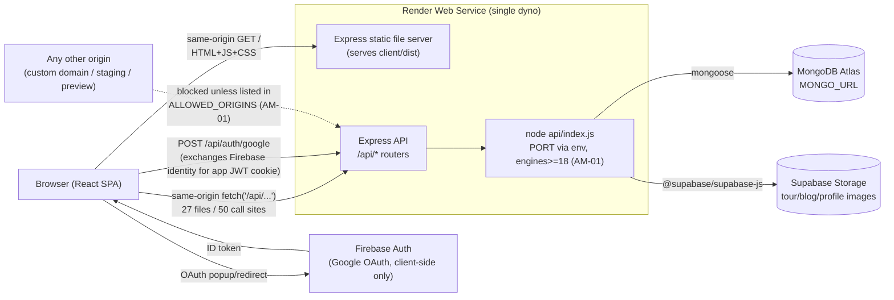

# Reverse-engineered deployment topology

No architecture diagram exists anywhere in the repo or README — this is
reconstructed purely from reading configuration and entrypoint code (the
textbook definition of reverse engineering: recovering a design-level
description from an implementation with no design docs).

## Evidence trail

| Fact | Source |
|---|---|
| Single Node/Express process serves both the API and the built SPA | `api/index.js`: `app.use(express.static(clientDistPath))` + `app.get("*", ...sendFile(index.html))` catch-all, mounted alongside `/api/*` routers |
| Build produces the static assets the API then serves | root `package.json` → `"build": "npm install && npm install --prefix client && npm run build --prefix client"` — builds client into `client/dist`, which `api/index.js` points at via `path.join(__dirname, "..", "client", "dist")` |
| Runtime port is platform-assigned | `const PORT = process.env.PORT \|\| 8080;` in `api/index.js` — the `\|\| 8080` fallback is exactly the pattern PaaS platforms (Render, Heroku) require, since they inject `PORT` themselves |
| Production origin is Render | hardcoded pre-AM-01 CORS origin `https://ghuroo.onrender.com`, and README's "Live Link" |
| Database is external/managed | `api/config/db.js` → `mongoose.connect(process.env.MONGO_URL)`, README instructs "MongoDB (local or Atlas)" |
| Image storage is external/managed | `api/utils/supabaseStorage.js`, `SUPABASE_URL`/`SUPABASE_ANON_KEY` in `api/.env` |
| Auth is split client/server | Client: `client/src/firebase.js` (Google OAuth via Firebase Auth SDK, **config hardcoded in source**, not read from the `VITE_FIREBASE_*` vars the README documents — see note below). Server: `jsonwebtoken` + `bcryptjs` (`api/utils/jwt.js`) issue/verify the app's own session cookie after OAuth or email/password login; `firebase-admin` is a declared dependency but **unused** (`grep -ri firebase api/` → no hits) |
| No IaC / platform config file in-repo | no `render.yaml`, `Procfile`, `vercel.json`, or `Dockerfile` found — Render service settings (build command, start command, env vars) are configured out-of-band in the Render dashboard, not version-controlled |

## Reconstructed diagram

## Note on the Firebase config drift

`client/src/firebase.js` hardcodes `firebaseConfig` (apiKey, authDomain,
projectId, etc.) directly in source rather than reading
`import.meta.env.VITE_FIREBASE_*`, even though the README documents those
six `VITE_FIREBASE_*` variables as required client `.env` entries. This is
**not a security defect** — Firebase web SDK config is designed to be public,
protected by Firebase Security Rules and authorized-domains allow-listing,
not secrecy — but it is a genuine documentation/implementation mismatch and a
natural **next candidate** for a future adaptive-maintenance pass (making the
client's Firebase project swappable per environment the same way AM-01 made
the CORS allow-list swappable). Logged as backlog, not implemented in this
cycle — see `MAINTENANCE_REPORT.md` Part B, "Backlog / Out of scope".
